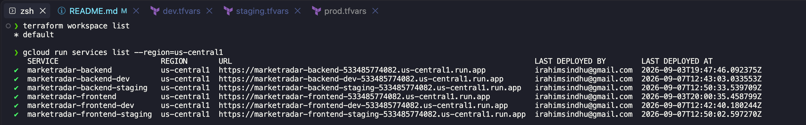

Omitting this causes a cryptic `exec format error` on Cloud Run with no indication of the real cause — the container image builds and pushes successfully, and only fails at the Cloud Run startup health check stage.

## Progress Gallery

### Day 1 — Price data + technical indicators


### Day 2 — Multi-ticker comparison


### Day 3 - MCP server + agent loop


### Day 4 - Chat UI Working


### Day 5 - Live on Google Cloud Run


### Terraform Stage 3 - Three isolated environments running from one codebase


## Sample output — research_ticker

```python
from agent.tools.research import research_ticker

result = research_ticker("NVDA")

# {
#   "ticker": "NVDA",
#   "company_name": "NVIDIA Corporation",
#   "sector": "Technology",
#   "market_cap": 5253179637760,
#   "pe_ratio": 27.5,
#   "forward_pe": 14.2,
#   "volatility": 0.4627,
#   "rsi": 50.0,
#   "trend": "bullish",
#   "recent_headlines": [...]
# }
```

## Setup

pip install -r requirements.txt
cp .env.example .env # add your API keys

## Testing

pytest agent/tests/ -v

## Known limitations
- News search uses loose keyword matching (NewsAPI), which can occasionally surface tangentially related articles (e.g. searching "Apple" returning unrelated results). The agent layer will need to account for this when synthesizing answers.