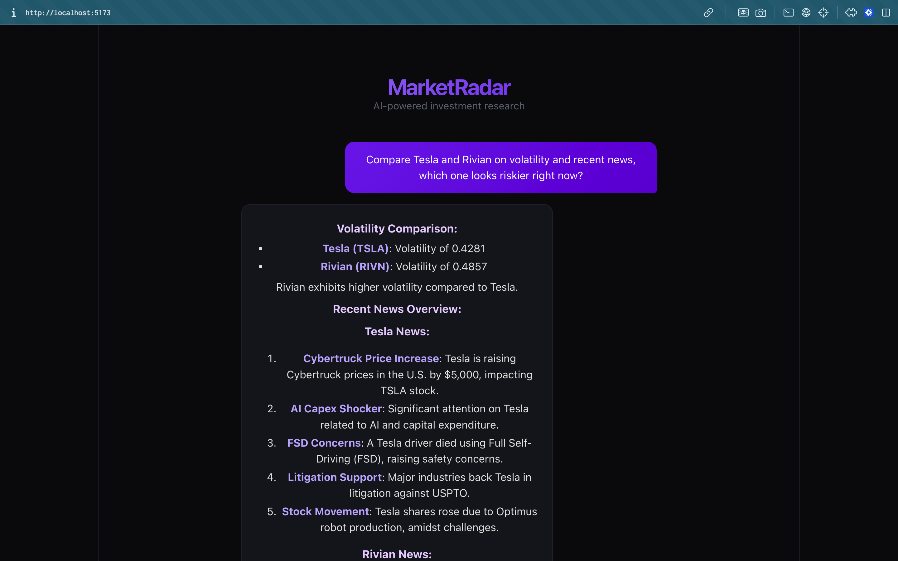
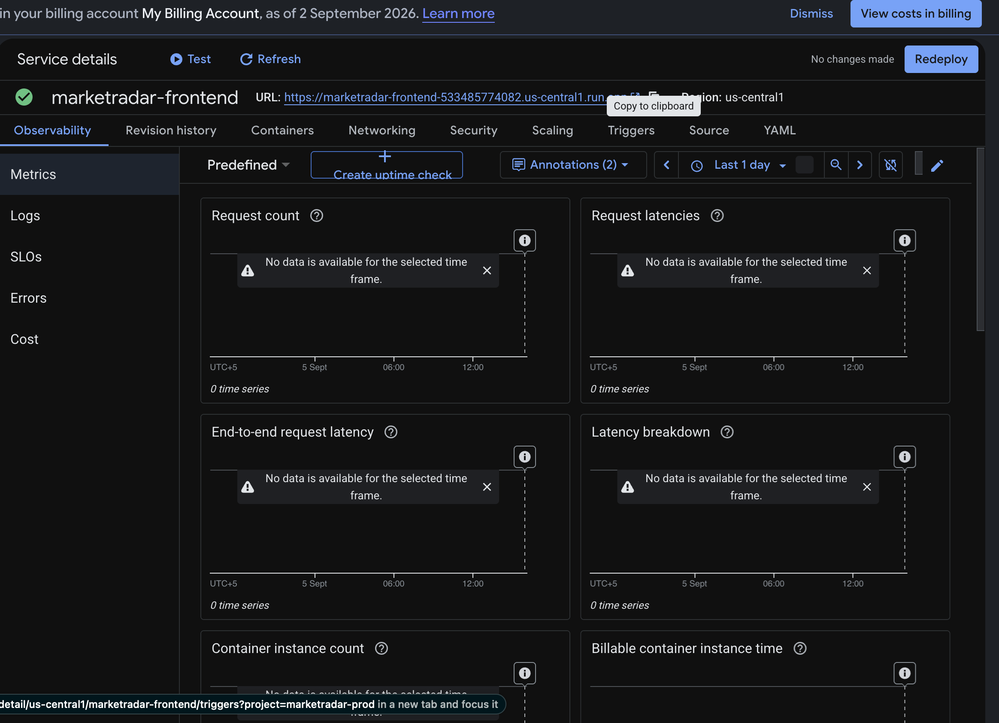
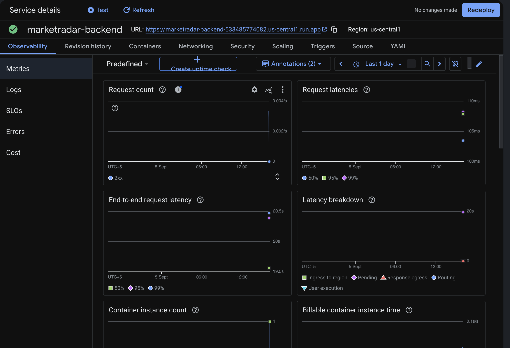
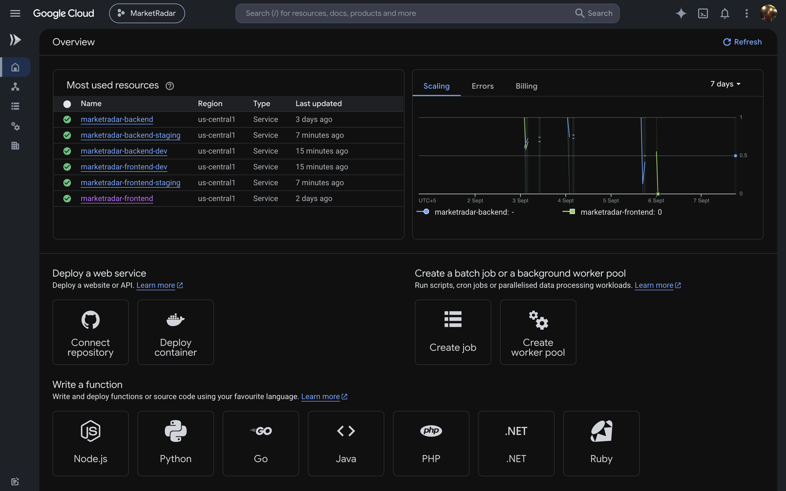
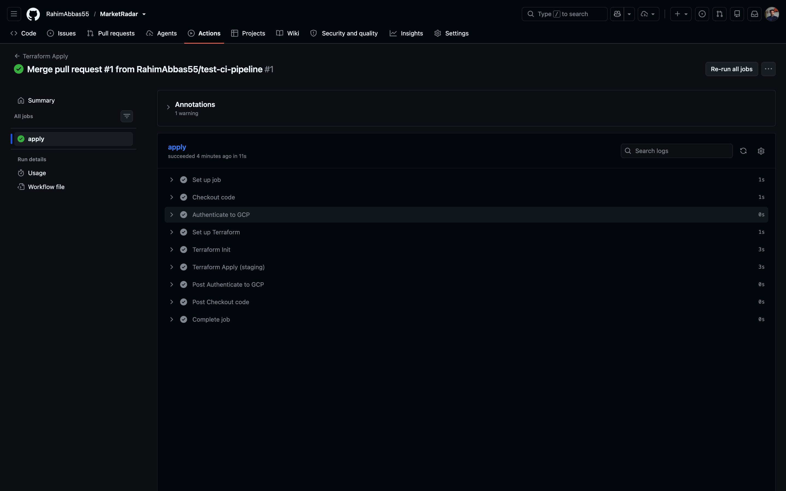

# MarketRadar


An MCP-powered agent for market and investment research. Ask natural-language questions like "compare Tesla and Rivian on volatility and recent news sentiment" and the agent chains together tool calls to pull live prices, compute technical indicators, search news, and synthesize an answer.

## Status
MarketRadar is complete: a fully deployed, production-pattern AI agent with an MCP-powered backend, live GCP infrastructure across three isolated environments, and a complete Terraform learning arc (modules, multi-environment, remote state, CI/CD, and drift reconciliation) all verified against real infrastructure.

## Stack
- Python 3.12, OpenAI function calling, MCP SDK
- FastAPI backend, React + TypeScript frontend
- GCP (Cloud Run, Artifact Registry, Secret Manager) provisioned via modular, multi-environment Terraform, with remote state and GitHub Actions CI/CD

## Tools (MCP) — status
- `get_stock_price` — historical + current OHLCV data ✅ built + tested
- `calculate_technical_indicators` (volatility, RSI, moving averages) ✅ built + tested
- `search_market_news` — recent news by ticker/company ✅ built + tested
- `get_company_fundamentals` — market cap, P/E, sector, 52-week range ✅ built + tested
- `compare_assets` — multi-ticker comparison with partial-failure handling ✅ built + tested
- `research_ticker` — full single-ticker research snapshot ✅ built + tested
- MCP server wrapper (all 6 tools registered) ✅ built + tested
- Agent loop (OpenAI function calling + MCP execution) ✅ built + tested
- FastAPI layer with persistent MCP session ✅ built + tested
- Streaming chat endpoint (SSE, tool-call trace events) ✅ built + tested
- React frontend with live tool-call trace + markdown rendering ✅ built + tested
- Docker containerization (backend + frontend) ✅ built + tested
- GCP deployment via Terraform (Cloud Run, Artifact Registry, Secret Manager) ✅ live
- Terraform modularization (registry, secrets, compute modules) ✅ complete
- Multi-environment Terraform via workspaces (prod/dev/staging) ✅ complete
- Remote state (GCS) + CI/CD (GitHub Actions) ✅ complete
- Drift detection practice ✅ complete

## Daily Progress Log

### Day 1 — Core data tools
Built the foundational data-fetching layer.
- `get_stock_price` — historical + current OHLCV data via yfinance, with error handling for invalid tickers and empty responses
- `calculate_technical_indicators` — volatility (annualized, log-return based), RSI, and SMA/EMA moving averages
- `get_all_indicators` — composite function combining price fetch with all three indicators in one call
- Manual test scripts + unit tests (pytest) covering both happy paths and error cases
- Debugging note: chased a false bug caused by a stale Python shell session not picking up file edits — reinforced the habit of restarting the interpreter after every code change

### Day 2 — News, fundamentals, and comparison
Rounded out the data layer and built the first composite research tools.
- `search_market_news` — recent news search via NewsAPI, with rate-limit and network error handling
- `get_company_fundamentals` — market cap, P/E ratios, sector, industry, 52-week range via yfinance
- `compare_assets` — multi-ticker comparison tool with partial-failure handling, so one invalid ticker doesn't crash the whole request
- `research_ticker` — master function returning a full research snapshot (price, indicators, fundamentals, news) for a single ticker
- Full unit test coverage for fundamentals and comparison logic
- Known limitation surfaced: NewsAPI's keyword search can return loosely related results (e.g. "Apple" matching unrelated articles) — flagged for the agent layer to handle during synthesis
- Debugging note: a "fixed" bug wasn't actually fixed because the file had been edited but the Python session was stale — same root cause as Day 1, now a known gotcha

### Day 3 — MCP server + agent loop
The biggest day yet: wrapped all tools as an MCP server, then built and verified the actual AI agent on top of it.

**MCP server**
- Scaffolded with FastMCP, pinned to `mcp<2` after discovering the installed 2.x version renamed `FastMCP` to `MCPServer` with a different API
- Registered all 6 tools using `@mcp.tool()` decorators
- Built a real MCP client test that spawns the server as a subprocess and communicates over stdio, exactly how an AI agent would connect to it

**Agent loop**
- Built the core loop: OpenAI (gpt-4o) receives the user's question and available tools, decides which to call, we execute them via the live MCP session, and feed results back until the model has enough to answer
- Converted MCP tool schemas directly into OpenAI's function-calling format, reusing the JSON Schema FastMCP already generates from type hints
- Verified single-tool questions ("what's Tesla's RSI") and multi-tool chaining questions ("compare Tesla and Rivian, which is riskier") — the second correctly triggered 3 tool calls and produced a real reasoned judgment based on both volatility numbers and news sentiment, not just a data dump
- Added error handling so a failed tool call doesn't crash the loop — the model receives the error as if it were a normal tool response and explains it naturally to the user
- Added a max iteration safety limit to prevent infinite tool-calling loops

**Debugging notes**
- Tool descriptions were blank because they were written as `#` comments above each function instead of actual docstrings inside the function body — MCP reads `__doc__`, not source comments
- The server file had no `if __name__ == "__main__": mcp.run()` block at all, so it exited immediately instead of listening for connections — surfaced as a confusing "Connection closed" error on the client side with no other clues
- Multi-line async code doesn't paste cleanly into the interactive Python REPL due to indentation parsing — worth just using script files for anything beyond a one-liner

### Day 4 — FastAPI, streaming, and full frontend
The biggest single day yet — went from a backend-only agent to a complete, usable product.

**Backend**
- Built a FastAPI app with a persistent MCP session managed via lifespan context, avoiding a new subprocess per request
- Added both `POST /chat` (standard) and `POST /chat/stream` (SSE) endpoints
- Fixed a CORS issue where the browser's automatic preflight `OPTIONS` request was being rejected with 405, since FastAPI had no CORS middleware configured

**Frontend**
- Scaffolded with React + Vite + TypeScript
- Built a chat UI wired to the streaming endpoint via manual SSE parsing (browsers' built-in `EventSource` doesn't support POST, so the protocol is parsed by hand from a `fetch` response stream)
- Added a live tool-call trace so the user sees "Calling compare stocks..." in real time while the agent works, not just a loading spinner
- Added markdown rendering for assistant responses, since the LLM naturally formats answers with headers and bullet points that were previously showing as raw `###` and `**` characters
- Full dark theme redesign matching the project's purple brand identity
- Polish: auto-scroll to latest message, visually distinct error states for connection failures, auto-focus back to the input after each response

**Debugging notes**
- CORS preflight requests fail silently as generic 405s with no indication of the real cause unless you know to look for missing `CORSMiddleware`
- SSE responses can arrive split mid-event across network chunk boundaries — buffering and re-joining partial lines is required, not optional, for reliable parsing

### Day 5 — Containerization and live deployment
MarketRadar went from "runs on my machine" to actually live on the internet.

- Wrote a Dockerfile for the backend (Python 3.12, FastAPI + MCP subprocess in one container) and verified it locally before touching the cloud
- Wrote a multi-stage Dockerfile for the frontend (Node build stage → nginx serving stage), keeping the final image lean by discarding the Node.js toolchain entirely from the shipped image
- Set up a new GCP project, enabled Cloud Run, Artifact Registry, Secret Manager, and Cloud Build
- Pushed both images to Artifact Registry and deployed both services to Cloud Run
- Configured the frontend to use a build-time environment variable (`VITE_API_URL`) for the backend URL, so local development and production point to different backends without code changes
- Updated backend CORS to allow the deployed frontend's origin

**Debugging notes**
- Hit a GCP project quota limit while creating a new project — discovered that deleted projects still count against quota for a 30-day grace period, meaning deleting old projects doesn't free up quota immediately. Switched to a different Google account to unblock progress.
- Backend deployment failed with a cryptic `exec format error` and no further explanation from `gcloud`. Root cause: Docker images built on Apple Silicon default to `arm64`, but Cloud Run requires `amd64`. Fixed by explicitly building with `--platform linux/amd64`.
- CORS needed updating twice: once for local container-to-container testing (new localhost port), once for the actual deployed frontend origin — a reminder that CORS configuration needs revisiting at every new environment, not just once.

Both services verified end-to-end in production: a real question, through the live frontend, hits the live backend, spins up the MCP subprocess, calls OpenAI, and returns a grounded answer — the full pipeline working exactly as it does locally, just now reachable from anywhere.

### Terraform Stage 1 — From manual deployment to infrastructure-as-code
Took the manually deployed GCP infrastructure and brought it fully under Terraform management.

- Set up the Google provider and defined the Artifact Registry repository, both Cloud Run services (frontend + backend), and Secret Manager resources for API keys entirely in `.tf` files
- Moved API keys out of plain Cloud Run environment variables into Secret Manager, with proper IAM bindings granting Cloud Run's service account read access
- Used `terraform import` to bring the already-existing, manually-created resources (Artifact Registry repo, both Cloud Run services) under Terraform's management without destroying and recreating them — verified via `terraform plan` showing zero unwanted destroys before ever running apply
- Ran a clean `terraform apply` twice (once for the backend + secrets, once for the frontend), both completing without errors

**Debugging notes**
- Accidentally committed a 109MB Terraform provider binary before `.gitignore` caught up, which GitHub rejected outright. Fixed by resetting local commits (safe since they hadn't been pushed yet) and redoing them with `.terraform/` properly excluded from the start.
- `terraform plan` briefly displayed both real API keys in plaintext during a diff, since existing (non-sensitive-declared) resource values aren't masked the same way `sensitive` variables are. Rotated both keys immediately as a precaution.
- Discovered intermittent yfinance failures specifically in the deployed (Cloud Run) environment — Yahoo Finance occasionally rate-limits or briefly rejects requests from cloud provider IP ranges, since yfinance is an unofficial library, not a stable public API. The existing error handling already handles this gracefully; retrying the same request shortly after typically succeeds.
- Learned that using `:latest` as an image tag in Terraform means Terraform can't detect when the underlying image changes, since the tag string never changes — a real limitation worth addressing with versioned tags or digests in a future pass.

MarketRadar's entire GCP footprint — registry, both services, secrets, and IAM — can now be destroyed and recreated from scratch with `terraform apply`, with zero manual `gcloud` commands required.

### Terraform Stage 2 — Modularization
Refactored the flat `main.tf` into three reusable modules: `registry` (Artifact Registry), `secrets` (Secret Manager secret + version + IAM access, bundled as one unit), and `compute` (Cloud Run service + public IAM binding, parameterized to handle both plain env vars and Secret Manager-sourced ones via a `dynamic` block).

- The `compute` module is called twice (backend, frontend) and the `secrets` module is called twice (OpenAI key, NewsAPI key) — replacing what were previously near-duplicate resource blocks with single, reusable definitions
- Used `terraform state mv` to remap all 11 existing resources from their old flat addresses to their new module-based addresses, without touching any real infrastructure — verified via `terraform plan` showing 0 to add and 0 to destroy both before and after the move
- The only actual change applied was a harmless metadata normalization on the frontend service (clearing `client`/`client_version` fields originally set by `gcloud`, since the resource is now fully Terraform-managed)

**Debugging note:** A `git push` was rejected by GitHub's secret scanning push protection after Terraform's automatic timestamped state backup files (`terraform.tfstate.<timestamp>.backup`, created during each `state mv` operation) were accidentally committed, exposing API keys in plaintext. `.gitignore` only had `terraform.tfstate.backup` covered, not the timestamped variant Terraform actually generates. Fixed by broadening the ignore pattern and resetting the unpushed commit before recommitting cleanly. Both API keys were rotated as a precaution.

This is the safe way to refactor Terraform code for infrastructure that's already live — the alternative (not using `state mv`) would have destroyed and recreated the entire running application.

### Terraform Stage 3 — Multi-environment via workspaces
Added dev and staging environments alongside the existing production infrastructure, using Terraform workspaces for full state isolation.

- Added an `environment` variable with input validation (`dev`, `staging`, or `prod` only — anything else fails immediately with a clear error)
- Used a `locals` block to conditionally suffix resource names based on environment (`marketradar-backend-dev`, `marketradar-backend-staging`) while leaving production's existing resource names untouched (no suffix for `prod`), avoiding any downtime or recreation of live resources
- Created separate `environments/prod.tfvars`, `dev.tfvars`, and `staging.tfvars` files, each gitignored to keep real API keys out of version control
- Used `terraform workspace new` to create fully isolated state for `dev` and `staging`, each with its own Artifact Registry repo, Secret Manager secrets, and Cloud Run services — completely separate from production's state
- Verified isolation empirically: deployed dev and staging independently, confirmed all three environments' backends respond correctly via their own URLs, and confirmed production remained completely unaffected throughout

**Debugging notes — the most important lesson of this stage:** The first attempt to run `terraform plan` for the `dev` environment, without first switching to a dedicated workspace, produced a plan to **destroy and recreate all 11 existing production resources** under new `-dev` names. This happened because Terraform's state has no inherent concept of "environment" — it only tracks resource addresses, and changing a resource's name in code (via the new `-${var.environment}` suffix) looks identical, from Terraform's perspective, to deleting the old resource and creating an entirely new one. Since the state file was shared (the `default` workspace, holding all of prod's real state), applying this plan would have taken the live application offline and destroyed its Secret Manager secret history. Caught before applying by reviewing the plan output carefully (`-/+ must be replaced` on every resource) rather than assuming a plan matching expectations. The actual fix was `terraform workspace new dev`, which gives each environment a fully separate state file, so name changes in one workspace's config never threaten resources tracked in another.

A secondary, recurring lesson: Terraform workspaces store their state under `terraform.tfstate.d/<workspace>/`, a location not covered by earlier `.gitignore` rules. This caused a second accidental secret exposure (caught by GitHub's push protection before going public) when a bare `git add .` swept up this new directory. Reinforced a standing rule for this project going forward: never use `git add .` inside `terraform/` — always add specific files by name.

All three environments — prod, dev, and staging — now run as fully independent, isolated deployments from the same Terraform codebase, switchable via `terraform workspace select <name>`.

### Terraform Stage 4 — Remote state + CI/CD
Moved Terraform state off local disk and automated the plan/apply cycle through GitHub Actions.

- Created a GCS bucket with versioning enabled as the remote state backend, migrated all three workspaces' state (`terraform init -migrate-state`) with zero drift verified afterward on both prod and staging
- Created a dedicated GCP service account for CI, scoped with Editor, Storage Admin, and Secret Manager Accessor roles, authenticated via a JSON key stored as a GitHub repository secret
- Built two GitHub Actions workflows: `terraform-plan.yml` runs on every pull request touching `terraform/`, posting a plan for review before merge; `terraform-apply.yml` runs automatically on merge to `main`, applying changes to the staging environment only — production remains a deliberate manual step
- Verified the full pipeline end-to-end with a real (trivial, safe) change: opened a PR, watched the plan succeed in CI, merged it, and watched the apply succeed automatically

**Debugging notes**
- First CI run failed because the workflow referenced a gitignored `.tfvars` file that, correctly, doesn't exist in GitHub's checkout of the repo. Fixed by passing all variables (including `environment`) as explicit `-var` CLI flags sourced from GitHub Secrets, rather than depending on any local-only file — the correct pattern for CI generally, since tfvars files are meant for human-run local commands.
- Second failure: the GitHub Actions service account could create most resources but was denied read access to Secret Manager secret *values* specifically (`secretmanager.versions.access`), since `roles/editor` doesn't include that specific permission. Fixed by granting `roles/secretmanager.secretAccessor` explicitly to the CI service account.
- Third failure: Cloud Resource Manager API was never explicitly enabled for the project, which the `data "google_project"` lookup depends on — worked locally only because personal `gcloud auth` credentials have broader default access than a purpose-built service account.

Production deploys remain manual and deliberate; staging now deploys automatically on every merge to main, giving a safe, continuously-verified environment to test against before ever touching production Terraform state by hand.

### Terraform Stage 5 — Drift detection and reconciliation
Deliberately introduced infrastructure drift and practiced detecting and reconciling it — the final stage of the Terraform roadmap.

- Manually added an environment variable (`DRIFT_TEST`) directly to the staging backend service via `gcloud run services update`, bypassing Terraform entirely
- Ran `terraform plan`, which correctly detected the unauthorized change and proposed removing it — Terraform always treats its own configuration as the source of truth, flagging anything that diverges regardless of how the divergence happened
- Reconciled by running `terraform apply`, restoring the service to exactly match version-controlled configuration, verified via a follow-up `terraform plan` showing "No changes"

**Debugging note:** While reconciling, an initial `terraform plan` attempt used a placeholder value instead of the real secret values for the `-var` CLI flags. Since Terraform's Secret Manager resources compare the *actual value* passed in against what's stored, this triggered an unrelated plan to destroy and recreate both secret versions — a sharp edge of passing secrets via CLI flags rather than a consistently-read `.tfvars` file. Caught before applying by reviewing the plan output carefully rather than assuming only the intended change would appear. This is a real, generalizable lesson: always double check that command output matches expectations exactly, especially for anything touching secrets, before typing `yes`.

This closes out the full Terraform learning roadmap: flat config with import (Stage 1), modularization (Stage 2), multi-environment isolation via workspaces (Stage 3), remote state and CI/CD (Stage 4), and drift detection with reconciliation (Stage 5) — all practiced against real, live infrastructure rather than a toy example.

## Deployment

**Production frontend (live):** https://marketradar-frontend-533485774082.us-central1.run.app/

**Production backend (live):** https://marketradar-backend-533485774082.us-central1.run.app

Dev and staging environments are deployed under `-dev` and `-staging` suffixed Cloud Run services in the same GCP project, isolated via separate Terraform workspaces. Staging deploys automatically via GitHub Actions on every merge to `main`.

All environments provisioned entirely via modular, multi-environment Terraform (see `terraform/`) with remote state in GCS, containerized with Docker, pushed via Artifact Registry.

### Known limitation: intermittent yfinance failures in cloud environments
Since yfinance is an unofficial library accessing Yahoo Finance's internal endpoints (not a stable public API), requests from cloud provider IP ranges (including GCP) are occasionally rate-limited or briefly rejected. This surfaces as an "insufficient data" error on some requests, which the agent explains gracefully rather than crashing, but the same question retried shortly after often succeeds. This is a known constraint of the underlying data source, not a bug in the application logic.

### Note on Apple Silicon builds
Docker images built on an Apple Silicon Mac (M1/M2/M3) default to `arm64` architecture, but Cloud Run requires `amd64`. Build with the platform flag explicitly:

docker build --platform linux/amd64 -t <image-name> .

Omitting this causes a cryptic `exec format error` on Cloud Run with no indication of the real cause — the container image builds and pushes successfully, and only fails at the Cloud Run startup health check stage.

## Progress Gallery

### Day 1 — Price data + technical indicators


### Day 2 — Multi-ticker comparison


### Day 3 - MCP server + agent loop


### Day 4 - Chat UI Working


### Day 5 - Live on Google Cloud Run



### Terraform Stage 3 - Three isolated environments running from one codebase


### Terraform Stage 4 - CI/CD pipeline passing


## Sample output — research_ticker

```python
from agent.tools.research import research_ticker

result = research_ticker("NVDA")

# {
#   "ticker": "NVDA",
#   "company_name": "NVIDIA Corporation",
#   "sector": "Technology",
#   "market_cap": 5253179637760,
#   "pe_ratio": 27.5,
#   "forward_pe": 14.2,
#   "volatility": 0.4627,
#   "rsi": 50.0,
#   "trend": "bullish",
#   "recent_headlines": [...]
# }
```

## Setup

pip install -r requirements.txt
cp .env.example .env # add your API keys

## Testing

pytest agent/tests/ -v

## Known limitations
- News search uses loose keyword matching (NewsAPI), which can occasionally surface tangentially related articles (e.g. searching "Apple" returning unrelated results). The agent layer will need to account for this when synthesizing answers.