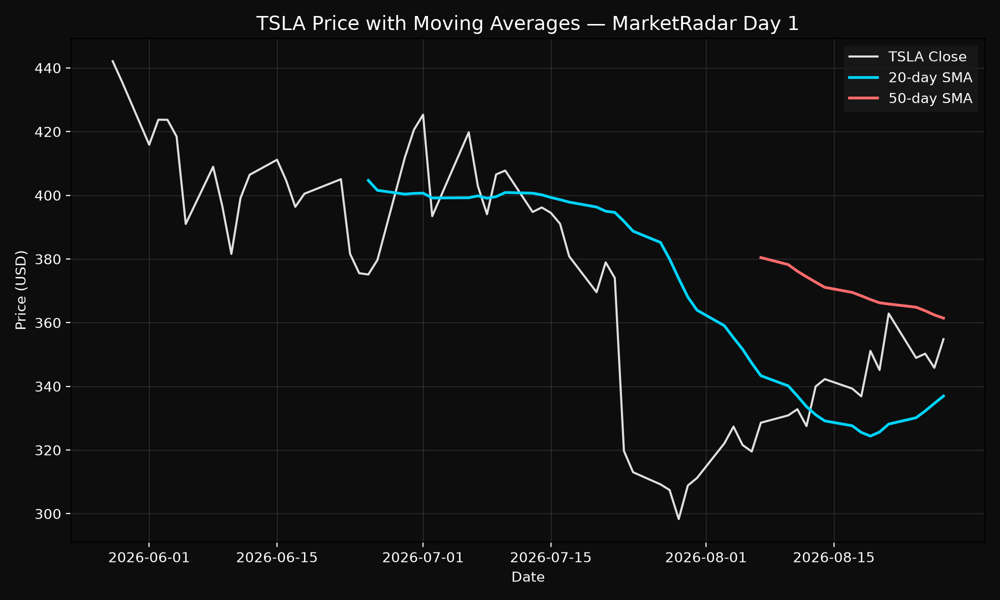
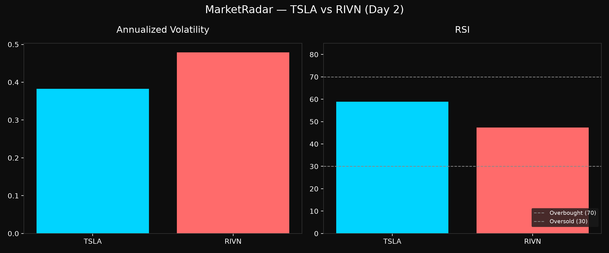
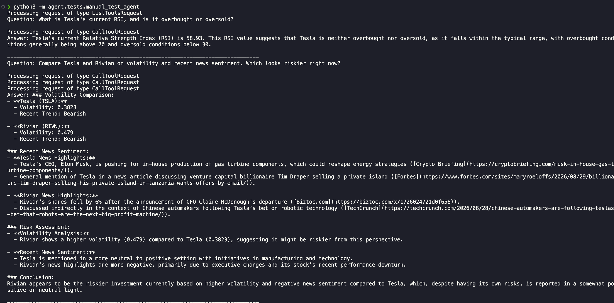

# MarketRadar

An MCP-powered agent for market and investment research. Ask natural-language questions like "compare Tesla and Rivian on volatility and recent news sentiment" and the agent chains together tool calls to pull live prices, compute technical indicators, search news, and synthesize an answer.

## Status
Day 3 complete — MCP server built and verified, full agent loop working end-to-end with real tool orchestration.

## Stack
- Python 3.12, OpenAI function calling, MCP SDK
- FastAPI backend, React + TypeScript frontend
- GCP (Cloud Run, Artifact Registry, Secret Manager) provisioned via Terraform

## Tools (MCP) — status
- `get_stock_price` — historical + current OHLCV data ✅ built + tested
- `calculate_technical_indicators` (volatility, RSI, moving averages) ✅ built + tested
- `search_market_news` — recent news by ticker/company ✅ built + tested
- `get_company_fundamentals` — market cap, P/E, sector, 52-week range ✅ built + tested
- `compare_assets` — multi-ticker comparison with partial-failure handling ✅ built + tested
- `research_ticker` — full single-ticker research snapshot ✅ built + tested
- MCP server wrapper (all 6 tools registered) ✅ built + tested
- Agent loop (OpenAI function calling + MCP execution) ✅ built + tested
- FastAPI wrapper + streaming ⏳ Day 4
- React frontend ⏳ Day 5+

## Daily Progress Log

### Day 1 — Core data tools
Built the foundational data-fetching layer.
- `get_stock_price` — historical + current OHLCV data via yfinance, with error handling for invalid tickers and empty responses
- `calculate_technical_indicators` — volatility (annualized, log-return based), RSI, and SMA/EMA moving averages
- `get_all_indicators` — composite function combining price fetch with all three indicators in one call
- Manual test scripts + unit tests (pytest) covering both happy paths and error cases
- Debugging note: chased a false bug caused by a stale Python shell session not picking up file edits — reinforced the habit of restarting the interpreter after every code change

### Day 2 — News, fundamentals, and comparison
Rounded out the data layer and built the first composite research tools.
- `search_market_news` — recent news search via NewsAPI, with rate-limit and network error handling
- `get_company_fundamentals` — market cap, P/E ratios, sector, industry, 52-week range via yfinance
- `compare_assets` — multi-ticker comparison tool with partial-failure handling, so one invalid ticker doesn't crash the whole request
- `research_ticker` — master function returning a full research snapshot (price, indicators, fundamentals, news) for a single ticker
- Full unit test coverage for fundamentals and comparison logic
- Known limitation surfaced: NewsAPI's keyword search can return loosely related results (e.g. "Apple" matching unrelated articles) — flagged for the agent layer to handle during synthesis
- Debugging note: a "fixed" bug wasn't actually fixed because the file had been edited but the Python session was stale — same root cause as Day 1, now a known gotcha

### Day 3 — MCP server + agent loop
The biggest day yet: wrapped all tools as an MCP server, then built and verified the actual AI agent on top of it.

**MCP server**
- Scaffolded with FastMCP, pinned to `mcp<2` after discovering the installed 2.x version renamed `FastMCP` to `MCPServer` with a different API
- Registered all 6 tools using `@mcp.tool()` decorators
- Built a real MCP client test that spawns the server as a subprocess and communicates over stdio, exactly how an AI agent would connect to it

**Agent loop**
- Built the core loop: OpenAI (gpt-4o) receives the user's question and available tools, decides which to call, we execute them via the live MCP session, and feed results back until the model has enough to answer
- Converted MCP tool schemas directly into OpenAI's function-calling format, reusing the JSON Schema FastMCP already generates from type hints
- Verified single-tool questions ("what's Tesla's RSI") and multi-tool chaining questions ("compare Tesla and Rivian, which is riskier") — the second correctly triggered 3 tool calls and produced a real reasoned judgment based on both volatility numbers and news sentiment, not just a data dump
- Added error handling so a failed tool call doesn't crash the loop — the model receives the error as if it were a normal tool response and explains it naturally to the user
- Added a max iteration safety limit to prevent infinite tool-calling loops

**Debugging notes**
- Tool descriptions were blank because they were written as `#` comments above each function instead of actual docstrings inside the function body — MCP reads `__doc__`, not source comments
- The server file had no `if __name__ == "__main__": mcp.run()` block at all, so it exited immediately instead of listening for connections — surfaced as a confusing "Connection closed" error on the client side with no other clues
- Multi-line async code doesn't paste cleanly into the interactive Python REPL due to indentation parsing — worth just using script files for anything beyond a one-liner

## Progress Gallery

### Day 1 — Price data + technical indicators

### Day 2 — Multi-ticker comparison

### Day 3 - MCP server + agent loop

## Sample output — research_ticker

\`\`\`python
from agent.tools.research import research_ticker

result = research_ticker("NVDA")

# {
#   "ticker": "NVDA",
#   "company_name": "NVIDIA Corporation",
#   "sector": "Technology",
#   "market_cap": 5253179637760,
#   "pe_ratio": 27.5,
#   "forward_pe": 14.2,
#   "volatility": 0.4627,
#   "rsi": 50.0,
#   "trend": "bullish",
#   "recent_headlines": [...]
# }
\`\`\`

## Setup
\`\`\`
pip install -r requirements.txt
cp .env.example .env  # add your API keys
\`\`\`

## Testing
\`\`\`
pytest agent/tests/ -v
\`\`\`

## Known limitations
- News search uses loose keyword matching (NewsAPI), which can occasionally surface tangentially related articles (e.g. searching "Apple" returning unrelated results). The agent layer will need to account for this when synthesizing answers.